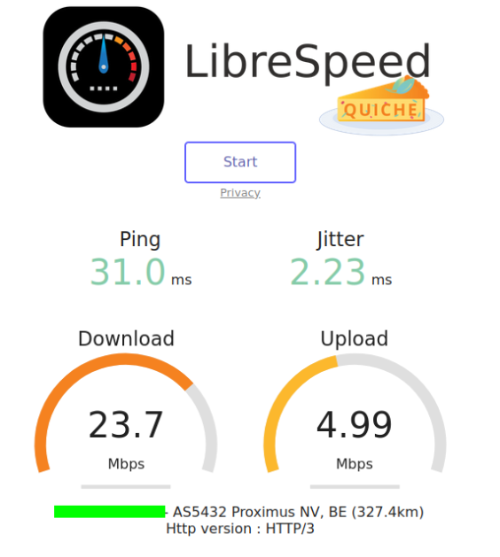
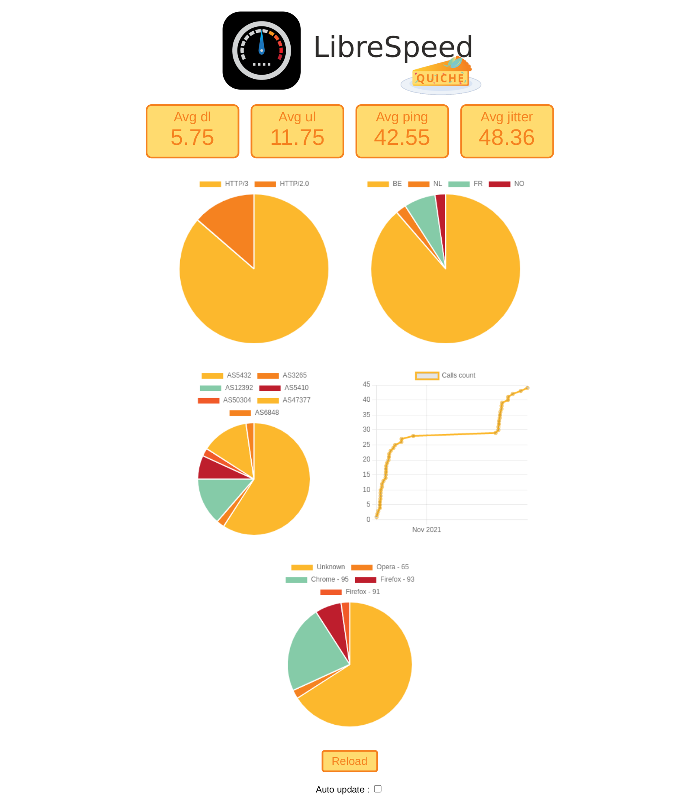

<!-- To make the pdf we use this VS Code extention https://marketplace.visualstudio.com/items?itemName=yzane.markdown-pdf  -->

# LINFO2142 - Group G - LibreSpeedQuic

  

> Giot Adrien & Gaudin Félix

  

## Preamble

  

[Librespeed](https://librespeed.org/) provides an open-source speedtest like server that runs above TCP. The
objective of this project is to deploy this test suite on a QUIC server (e.g. nginx using cloudflare’s quiche) and
explore the performance of QUIC when doing such speedtests.

In this report, we will make reference to our [GitHub repository](https://github.com/FelixGaudin/LibreSpeedQuic).
  

## Installation

quiche can be integrated into nginx using an unofficial patch to provide support for HTTP/3 (see [their Github](https://github.com/cloudflare/quiche)).

  

### Nginx with quiche

  

The patch only works with the 1.16.x release branch (the latest stable release being 1.16.1).

  

1. Install Rust

  

We must have a version of rust >=1.53 (use `rustc -V` to know the version).

  

If you don't have it juste use :

  

```bash

curl --proto '=https' --tlsv1.2 -sSf https://sh.rustup.rs | sh

```

Than you have to add the `cargo` binaries to your binary files :

```bash

sudo ln -s ~/.cargo/bin/cargo /bin/

```

  

2. Install PCRE

  

This will be used to configure nginx :

  

```bash

sudo apt-get install libpcre3 libpcre3-dev

```

  

3. Download nginx with the right version (1.16.1)

  

*You may have to remove nginx if you have another version installed*

  

```bash

curl -O https://nginx.org/download/nginx-1.16.1.tar.gz

tar xzvf nginx-1.16.1.tar.gz

```

  

4. Clone the quiche repository

```bash

git clone --recursive https://github.com/cloudflare/quiche

```

  

5. Apply the quiche patch to nginx

  

```bash

cd nginx-1.16.1

patch -p01 < ../quiche/extras/nginx/nginx-1.16.patch

```

  

6. Configure nginx

  

You can add more options. All options are available here : https://nginx.org/en/docs/configure.html

```bash

./configure \

--prefix=$PWD \

--build="quiche-$(git --git-dir=../quiche/.git rev-parse --short HEAD)" \

--with-http_ssl_module \

--with-http_v2_module \

--with-http_v3_module \

--with-openssl=../quiche/deps/boringssl \

--with-quiche=../quiche \

--with-pcre

```

  

7. Install the modified version

You can try :

```bash

make && make install

```

  

If you get an error with `cp conf/koi-win ...` while running the `make install` you have to comment the line and the three below (`cp conf/koi-win ...`, `cp conf/koi-utf ...` and `cp conf/win-utf ...`) and retry the commands.

  

8. Test it !

You can use `./sbin/nginx` to launch the server (and `killall nginx` to killit). By default the page url is at `localhost` and the default port is 80. (http://localhost:80)

  
  

## LibreSpeed

We will use the librespeed project to perform the speedtest. If you want to know more about it, please look at the project GitHub https://github.com/librespeed/speedtest .

  

To perform more tests we modified a bit the original files. They are in the folder `frontend`. To use them, you can just redirect the nginx root folder to it.

  

## Build the backend

  

### Files

  

-  `main.js` receives all the possible requests (GET and POST). Will listen on port 8888 by default. You can change it at the beginning of the file.

  

-  `helper.js` computes the distance between the server and the client.

  

-  `database.js` includes the [SQLite3](https://www.sqlite.org/index.html) database for telemetry.

  

-  `secret.js`  The file where you store your login and your password in order to acces to the dashboard. The file should look like this :

```js

const  LOGIN = "Your Login";

const  PASSWORD = "Your password";

  

module.exports = {

LOGIN :  LOGIN,

PASSWORD :  PASSWORD

}
```

  

### How to launch

  

#### Native

  

Just run `node main.js`. (You may have to install all the dependencies)

  

#### Docker

  

We dockerized the backend. You may run it using these commands (while being in the backend directory):

  

```bash

docker build . -t 

docker run -p 8888:8888 -d 

```  

## Modify the Nginx config

In order to enable HTTP/3 in nginx you have to modify the config file. It's located in `nginx-1.16.1/conf/nginx.conf`.

We made an example file [nginx_example.conf](https://github.com/FelixGaudin/LibreSpeedQuic/blob/main/nginx_example.conf). 

We will now describe its key elements.

This line enables quic :

```listen 443 quic reuseport;```

Also don't forget to enable TLSv1.3 otherwise quic won't work (`ssl_protocols TLSv1.3;`)

This line adds a header which informs the client of the possibility to switch to QUIC/HTTP3.

```add_header alt-svc 'h3-27=":443"; ma=86400, h3-28=":443"; ma=86400, h3-29=":443"; ma=86400, h3=":443"; ma=86400';```

### Case of 403 : Forbiden error

This may mean that your html files are in a folder with to strict permissions. First try this https://linuxhint.com/fix-nginx-403-forbidden/. It may not work, so just put the html files in a *normal* file (eg : /home/) and then use this https://stackoverflow.com/questions/10631933/nginx-static-file-serving-confusion-with-root-alias

## Current results

Depending on where the site is hosted, the speedtest is performed using HTTP/3 or HTTP/2. We first hosted the site on a personal computer. 
When we enabled HTTP/3 on it, we tried to move to the VM lent to us.


Up to now, we were not able to perform the speedtest using HTTP/3, even with a client supporting it while putting an alt-svc header in the server responses.
While looking for a way of forcing the switch to HTTP/3 on the VM, we discovered that the possibility of using DNS records to inform of the use of HTTP/3 was being studied by Google and Akamai (see [cloudflare blog](https://blog.cloudflare.com/speeding-up-https-and-http-3-negotiation-with-dns/) and [IETF draft](https://datatracker.ietf.org/doc/html/draft-ietf-dnsop-svcb-https-01)). 
We could not use that since it is not deployed yet.

Using a SSL certificate that was not autogenerated did not help either.


We also made tests using the OVH server of a friend of ours. They were quite successfull, since the speedtest was done using HTTP/3, and the results were consistent.

<p align="center">
  
</p>


## What's next ?

We have to decide whether we continue to work on forcing the use of HTTP/3 when using the VM, or wheter we explore another possibily (using an OVH server).
After that, we would like to compare the performances of HTTP/2 and HTTP/3 using our speedtest. 
We would like to allow students to perform some kind of comparative test when we are ready.
We already started to collect data while doing our tests on different hosts (see next section).


## Dashboard

> The data are provided form the test on a personnal computer.

<p align="center">
  
</p>

## Thanks

- Nicolas Bueul for helping us to make a SSL certificate on the personnal computer (allowing us to perform tests with several people).

- Guillaume Vandenneucker for lending his OVH server to test from a *real* server.

- Thomas Wirtgen for helping us in general and particulary to make a SSH bridge to test the webside (when the ports weren't opened)

- Olivier Bonaventure who gave us some food for thought on the problem (from the VM the webside is in HTTP/2)

- Chipie for the support

<p align="center">
  
</p>